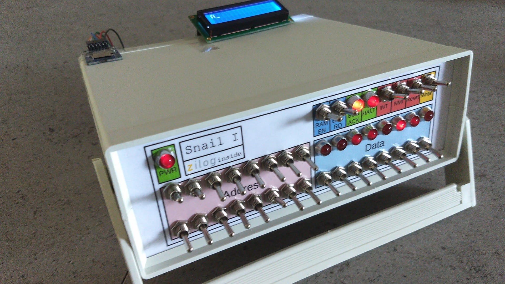

# Snail I by ThatLolaSnail

## Idea

The `Snail I` is a simple 8-bit computer based on the Z80 CPU. 
I (ThatLolaSnail) build it a few month ago. 
The main purpose was to be simple and easy to understand. 
I was inspired by the MOS/Commodore KIM-1. 
Even tho it has a 6502, I choose a Z80 for my computer, because I had the idea of eventually porting CP/M orsomething similar to it. 
The design of the Snail 1 is based on the computers from the 60's and 70's, I just like having lots of switches to control the computer.

My initial idea was to build everything by hand, and even write and assemble the programs by hand. That's why I'm writing this long after I've already given up on this project, with the hope of reviving it.



##  Hardware

- CPU: Z80
- RAM: 64k
- ROM: none
- peripherals: stuff I had laying around (SD card, LCD, maybe Keyboard??)

The processor is just a Z80. The RAM is just 64k static RAM (I use a 128k chip with A16 tied to GND).


### Front panel

The most interesting part is the front panel.
I used a ton of switches to control the CPU. 
In the top right, there are 6 switches and 2 LED's to control the system itself.

The first switch `RAM EN` is the enable/standby line of the RAM, is only optional.
It is used to turn off the ram into a battery backed standby mode, so you can disconnect the power supply without data loss (Rememver there is no rom). 
Turn this off (switch down) to turn the ram into standby.

The next switch is `BUS RQ`. 
Use this switch to request access to the ram to inspect memory or write to memory manually.
This switch is directly connected to the Bus Request line of the cpu. 
Turn this on (switch up) to request the bus aka the memory.
The CPU will answer with `BUS ACK`.

Next we have the LED `BUS ACK` aka Bus Acknowledge. The LED is directly connected to the CPU pin and to VCC, using an appropriate resistor. (line is active low, LED is normal).
When we requested the bus using `BUS RQ`, this lamp will tell us that we can now access the bus. (It takes a fraction of a second for the cpu to hand the bus over, this lamp is inly there to make sure).
The `BUS RQ` line is also connected to the buffers connecting the 16 address switches with the bus. So when the CPU grants access to us, the CPU lines go floating and the address switches put the manually entered address on the bus. We can now inspect the ram content at this address using the 8 LED's on the right half of the panel.

The Switch `Write` is actually just a pushbutton, 
so when you press the switch dowb, it returns back to the upper position. 
This switch controlls read and write access to the ram when the system is halted using the BUS RQ.
In the top position, the ram is enabled, so the content of the address set with the address switches gets put onto the bus and displayed with the LED's.
When you start pressing the button down, the ram output gets turned off and the buffers on the data switches get turned on, so that the manually entered number is now on the bus.
When the switch reaches the bottom position, the data from the bus, so the manually entered number, gets written into ram.
I think I used some glue logic to disable this switch when we don't have Bus Ack, but I would not recommend pressing the button without requesting the bus first...
(The io/ram line is pulled via a resistor to select the ram... I used pullups for too much...)

Next, wehave `INT`, `NMI` and `Reset`.
Pretty self explanatory... Just connected to the CPU lines... INT is the normal INTerrupt, it can be disabled by software, 
NMI is the NonMaskable Interrupt. Reset is just the Reset line, to reset all registers and start execution at 0x0000.
If you want to use the normal interrupt, use the configuration command to set the interrupt mode to 2, so the cpu doesn't try to ask an interrupt controler or something, 
because we don't have this complicated shit. In interrupt mode 2, a fixed address is used for interrupts.

Last but not least is the `HALT` LED, which is just connected to the HALT line of the CPU. When a program finishes, it uses a halt command, to stop the CPU and turn on this LED. So you don't have to guess weather the program is already done. 

Let's say, you wrote a program on paper, so first, turn on the power, enable BUS RQ, press Reset, and enable the ram (if your computer has this switch as well). Then type in the program by toggling in the 0th addrsss and the data for this address, press Write, select the 1st address, toggle in the data, press write and so on... When you're done, press reset, (if you haven't done that yet), and turn off BUS RQ. Remember that the CPU executes the first instruction after a reset before the Bus Request, so I would just use nop as the first instruction. So, when you entered the program, reset the cpu, and disabled Bus RQ, the program is running. If your program is short, it should finish after a fraction if a second. If the last ibstruction was HALT, the HALT LED will notify you that the program is done. Now turn Bus RQ back on and inspect the ram sing the switches, to see if your program worked.

### Hardware and Ports

The Z90 has IN and OUT instructions.
They don't use the 16 bit ram addresses but a seperate 8 bit hardware address.
The CPU selects between them with a memory/io line.

I use simple Registers as output and simple tri-state buffers as input. (Most I/O registers are only 4 bit, because I'm lazy...)

#### SD card Slot

I use a simple SD card slot. 
SD cards have 2 modes, the complex SD mode and the simple SPI mode. 
I'll use the simple spi mode, becuase the wiring and the protocol is easier. 
I used this micro sd card board which is common for arduino users, it includes level shifters and voltage regulators because sd cards use 3.3V and our system runs at 5V.

I use bitbanging to send and recieve Data.

I/O-Map:

| I/O Address | Descrition |   3    |   2    |   1    |   0    |
| ---         | ---        |  ---   |  ---   |  ---   |  ---   |
| 0x00  OUT   | SD card    |   (1)  |CS (1)  |SCK (0) |MOSI (1)|
| 0x10  IN    | SD card    |   -    |    -   |   -    |MISO    |

(Default values in brackets)


#### Hitachi LCD

Just the usual Hitachi LCD... 

I use 4-bit mode, because I'm lazy... Just send three times the command to select the 8-bit mode, so even when we are in 4-bit mode halfway through an lcd instruction, this procedure still works. Just send 30303020 to the lcd, if it is in 8-bit mode, it will be set to 8 bit mode three times and then to 4 bit mode, if it is already in 4-bit mode, the first 2 bytes are interpreted as one command to set the lcd to 8 bit mode, and the next command is another 8-bit mode command, and then we'll set it to 4-bit mode, and in case, the lcd is halfway through a 4-bit command, this will first complete the unfinished command, the next 2 bytes are interpreted as the command to switch to 8-bit mode and the last byte will select 4-bit mode. This simple procedure will set the lcd to 4-bit mode, no matter what state it started. This is all based on the example from wikipedia...

Now to my implementation. Note that I used the upper 4 bits for the data lines, because they need to connect to the upper 4 bits of the lcd. (Through a register, of course!)

I/O-Map:

| I/O Address | Descrition | 7 | 6 | 5 | 4 |  3   |  2  |  1  | 0   |
| ---         | ---        |---|---|---|---| ---  | --- | --- | --- |
| 0x00  OUT   | LCD/SD     | - | - | - | - |EN (1)| (1) | (0) |RS(1)|
| 0x20  OUT   | LCD        |D7 |D6 |D5 |D4 |  -   |  -  |  -  |  -  |

(Default values in brackets)

##### NOTE!!

**Some pins from the SD card and the LCD overlap.**
It is recommendet to initialize the sd card first, so it is in SPI mode. 
This will prevent the SD card from sending unwanted signals on the wrong lines.

#### PS/2 Keyboard

At this point, I gave up, because I wrote everything in assembly on paper, assembled it by hand and toggled it in manually... This was a slow process and I was bored of it...

I had the Idea of building a PS/2 interface... Or just use bitbanging... 
Maybe a combination of interrupts and bitbanging?? Or just tell the keyboard to wait, until we poll it manually (Yes, that would actually work, if a specific line is pulled low with a transistor, the keyboard will wait for the computer and resend the whole command again when the line goes back high... )

## Code

Until now, I wrote every program by hand with pencil on paper... My goal was to build a computer the exact way, I would have done it in the 70's. (In the 70's I would have used a 6502, not a Z80, of course.)

My idea with this repo is to write everyting again in a better form:

Only the SD card deriver should be toggled in manually, and a small 3-line program that loads a program from the sd card. 
So we can write code in assembly (or even C) on our computer, put it into the boot sector of the sd card, or anywhere else, an then plug the card in, with the bootloader (sd driver) manually entered, 
and the program will run, without deleting the bootloader, so we can just recompile, put on the sd card, and then try again, without the need to assemble and link by hand... 
And without the need to toggle in everything by hand. 
I still stand by my promise, that I'll never use a ROM, becaus this modern stuff ruins the feel of toggling in programs by hand.

## Assembler

I don't know which assembler I should use, so I just installed binutils.

I installed it the same way how I did it for the Classpad when I compiled [hollyhock-2](https://github.com/SnailMath/hollyhock-2/blob/master/doc/user/patching.md).


```
#Select the installation folder
export PREFIX="$HOME/opt/cross"

#Select the CPU architecture
export TARGET=z80-elf

#Add the path, I would add this line to ~/.bashrc
export PATH="$PREFIX/bin:$PATH"

#Download binutils...
#And go into that folder

#Now compile and install
mkdir build
cd build
../configure --target=$TARGET --prefix="$PREFIX" --with-sysroot --disable-nls --disable-werror
make
sudo make install
```

So... I haveen't tried `z80-elf-as` yet... I'll do that the next time, when the planet of the computers is lined up with the sun during a full moon...


